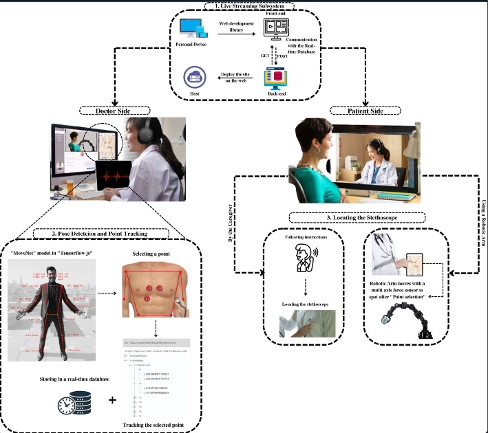

# BSc-Thesis-Telemedicine-Stethoscope

#### BSc (Hons) in Biomedical Engineering Thesis, **supervised by:** [Prof. Mohammed Ghazal](https://scholar.google.com/citations?user=9eUEmVIAAAAJ&hl=en)  

## Overview
This **Bachelor Thesis (A*)** presents the design, development, and implementation of the **Telemedicine Stethoscope System** – a novel solution aimed at improving remote auscultation in telemedicine. The system enables doctors to listen to a patient's heart and lung sounds in real-time while accurately positioning the stethoscope on the patient's body remotely. 

**Goal**: 
To bridge the gap between physical and virtual auscultation, enhancing remote healthcare accessibility.

---
## Design

### System Overview

The **Telemedicine Stethoscope System** is structured into **three core subsystems**:  




1. **Real-time Streaming Subsystem**  
Facilitates a **seamless** real-time connection between doctor and patient.  
   - **Client Interface**: Developed with **Angular (HTML, CSS, TypeScript)** for an intuitive UI.
   - **Server Backend**: Implemented in **Node.js** and deployed on **Heroku** for smooth communication.
   - **Deployment**: Hosted on **Firebase** for easy web access.
   - **Communication Protocol**: Uses **WebRTC** for peer-to-peer streaming and **Socket.io** for signaling.


  
2. **Pose Detection and Point Selection Tracking Subsystem**  
Empowers the doctor to **mark** the exact stethoscope placement point on the patient’s body.  
   - **Pose Estimation Model**: Utilizes **TensorFlow.js + MoveNet** to detect key body points (e.g., shoulders, chest).
   - **Selection Mechanism**: The doctor clicks on the **live video stream** to select a point, stored in **Firebase**.
   - **Real-Time Visualization**: A **red dot (stethoscope icon)** appears on the video feed, guiding the patient.
```text
Algorithm 1: Pose Detection and Point Selection Tracking Subsystem

Require: Video frame I
Ensure: Detected pose P and tracked point T
1. Load the MoveNet model
2. Define input parameters (e.g., image resolution, pose classes)
3. Pass I to the MoveNet model: P = MoveNet(I)
4. Identify the chest area based on key body part locations in P
5. Store coordinates of the chest area as T in the Real-time Database
6. Return P, T
```

  
3. **Locating the Stethoscope Location Subsystem**  
Ensures **accurate stethoscope placement** using a robotic arm.  
   1. **User Interface for Caregiver:**  
The caregiver can manually place the stethoscope by referring to the live video feed and the selected point, marked with a red dot on the UI.
   2. **Robotic Arm Assistance:**  
The system uses a **Dobot Robotic Arm** that receives coordinates from Firebase and moves the stethoscope to the specified location with high precision. The robotic arm uses inverse kinematics to determine the necessary joint angles based on the target coordinates:

      θ = f_inv(X)

       where:
          - **θ** represents the joint angles,
          - **X** is the target position (**x** and **y** coordinates),
          - **f_inv** denotes the inverse kinematics function.

A demonstration video of the robotic arm's movement is available below:
- [Watch Robotic Arm Test Here (Local)](./figures/ROBOTIC_ARM_TEST.mp4)
- [Watch Robotic Arm Test on Google Drive](https://drive.google.com/file/d/129X1QHnHIa02VOYFutS4KzQeHdDp3Whk/view?usp=sharing)


[Download Full PDF](./figures/Sys1.pdf)

---

## Hardware Components
The system integrates several hardware components to facilitate effective communication and precise stethoscope placement:
1. Digital Stethoscope - Thinklabs One
2. Audio Splitter and Cable
3. Sound Blaster USB
4. Headphones
5. ThinkLink
6. Dobot Robotic Arm


---

## Final Output

[Final Output PDF](./figures/Output.pdf) 

### Interface Navigation
To initiate a telemedicine consultation with the system:

1. Initiate the Process: Click on the provided system link to start the consultation.
2. Welcome Home: You will be directed to the home page, where you can begin a new call.
3. Start the Call: Click on the "Start a Call" button to initiate the session.
4. Share the Link: A unique consultation link will be generated; send it to your patient to join the consultation.
5. Activate Pose Detection: Click the “Start Pose Detection” button to initiate the interactive features for stethoscope placement.
6. Navigate the Patient: The system will highlight the selected point, guiding the patient to position the stethoscope accurately.


--- 
## License & Copyright 

This project is licensed under the **MIT License**. 

You are free to use, modify, and distribute this project for **educational and research purposes**, but proper credit must be given to the original author **(Noora-Alhajeri)**. 

### **Copyright Notice** 

© 2025 **Noora-Alhajeri**. All rights reserved. 

Originally Developed: **June 2023** 

Uploaded to GitHub: **2025** 
--- 

## Contact 

For questions or collaboration, feel free to reach out: 

📧 **Email:** [n.s3eedalhajeri@gmail.com](mailto:n.s3eedalhajeri@gmail.com)   

🌐 **LinkedIn:** [Noora-Alhajeri](https://www.linkedin.com/in/nsh-019)
