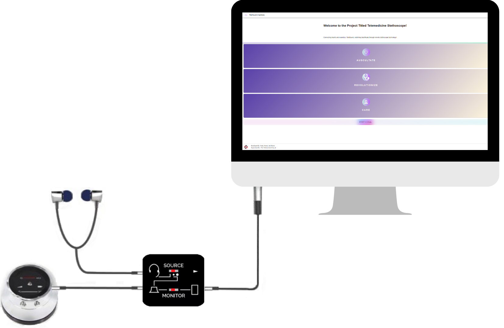

# BSc-Thesis-Telemedicine-Stethoscope

## Overview
This **Bachelor Thesis (A*)** presents the design, development, and implementation of the **Telemedicine Stethoscope System** – a novel solution aimed at improving remote auscultation in telemedicine. The system enables doctors to listen to a patient's heart and lung sounds in real-time while accurately positioning the stethoscope on the patient's body remotely. 

---
## Design

### System Overview

The Telemedicine Stethoscope System is composed of three primary subsystems:

1. **Real-time Streaming**  
Handles the real-time transmission of heart and lung sounds from the patient to the doctor with minimal latency.

2. **Pose Detection and Point Selection Tracking**  
Allows the doctor to accurately select a point on the patient’s chest for stethoscope placement by analyzing the patient’s pose.

3. **Locating the Stethoscope Location**  
Uses robotic arm assistance to automatically move the stethoscope to the selected position on the patient’s body.


---

### Component Design

#### 1. Live Streaming Subsystem

The live streaming subsystem enables a continuous video/audio connection between the patient and the doctor.
- **Client-side Interface:**  
Built using the Angular framework (HTML, CSS, and TypeScript) to create a dynamic and user-friendly interface.
  
- **Server-side Operations:**  
Implemented with Node.js, hosted on Heroku to handle backend operations and ensure smooth communication with the frontend.

- **Deployment:**  
The application is deployed on Firebase Hosting for seamless web access and scalability.

- **Workflow:**  
Peer-to-peer communication is established using WebRTC, and Socket.io enhances signaling. This workflow is shown in the diagram below.


---

#### 2. Pose Detection and Point Selection Tracking Subsystem

This subsystem allows the doctor to precisely select the location for stethoscope placement on the patient's chest.

- **Pose Estimation Model:**  
TensorFlow.js, in combination with the MoveNet model, is used for real-time estimation of the patient’s body pose. The system detects keypoints (e.g., shoulders) to determine the optimal chest area.

- **Tracked Point Selection:**  
During the video call, the doctor can click on the video stream to select the auscultation point. The system highlights this point with a red dot (stethoscope icon) and stores the coordinates in Firebase Realtime Database.

```text
Algorithm 1: Pose Detection and Point Selection Tracking Subsystem

Require: Video frame I
Ensure: Detected pose P and tracked point T
1. Load the MoveNet model
2. Define input parameters (e.g., image resolution, pose classes)
3. Pass I to the MoveNet model: P = MoveNet(I)
4. Identify the chest area based on key body part locations in P
5. Store coordinates of the chest area as T in the Real-time Database
6. Return P, T


---

#### 3. Locating the Stethoscope Subsystem

This subsystem ensures the stethoscope is accurately positioned on the patient’s body with the help of a robotic arm.

1. **User Interface for Caregiver:**  
The caregiver can manually place the stethoscope by referring to the live video feed and the selected point, marked with a red dot on the UI.


2. **Robotic Arm Assistance:**  
The system uses a **Dobot Robotic Arm** that receives coordinates from Firebase and moves the stethoscope to the specified location with high precision. The robotic arm uses inverse kinematics to determine the necessary joint angles based on the target coordinates:
   \[
   \theta = f_{\text{inv}}(X)
   \]
   
   where:
   - \( \theta \) represents the joint angles,
   - \( X \) is the target position (x and y coordinates),
   - \( f_{\text{inv}} \) denotes the inverse kinematics function.

A demonstration video of the robotic arm's movement is available below:
[Watch Robotic Arm Test](./figures/ROBOTIC_ARM_TEST.mp4)

---

## Hardware Components

The system integrates several hardware components to facilitate effective communication and precise stethoscope placement:
1. Digital Stethoscope - Thinklabs One
2. Audio Splitter and Cable
3. Sound Blaster USB
4. Headphones
5. ThinkLink


---

## Final Output

 

### Interface Navigation
To initiate a telemedicine consultation with the system:

1. Initiate the Process: Click on the provided system link to start the consultation.
2. Welcome Home: You will be directed to the home page, where you can begin a new call.
3. Start the Call: Click on the "Start a Call" button to initiate the session.
4. Share the Link: A unique consultation link will be generated; send it to your patient to join the consultation.
5. Activate Pose Detection: Click the “Start Pose Detection” button to initiate the interactive features for stethoscope placement.
6. Navigate the Patient: The system will highlight the selected point, guiding the patient to position the stethoscope accurately.


--- 
## License & Copyright 

This project is licensed under the **MIT License**. 

You are free to use, modify, and distribute this project for **educational and research purposes**, but proper credit must be given to the original author **(Noora-Alhajeri)**. 

### **Copyright Notice** 

© 2025 **Noora-Alhajeri**. All rights reserved. 

Originally Developed: **June 2023** 

Uploaded to GitHub: **2025** 
--- 

## Contact 

For questions or collaboration, feel free to reach out: 

📧 **Email:** [n.s3eedalhajeri@gmail.com](mailto:n.s3eedalhajeri@gmail.com)   

🌐 **LinkedIn:** [Noora-Alhajeri](https://www.linkedin.com/in/nsh-019)